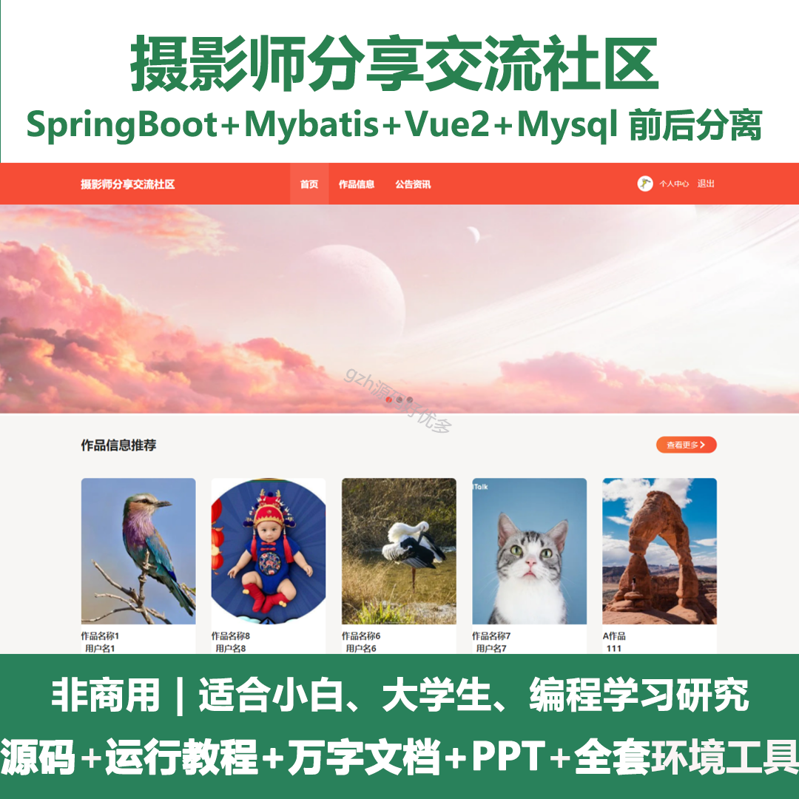
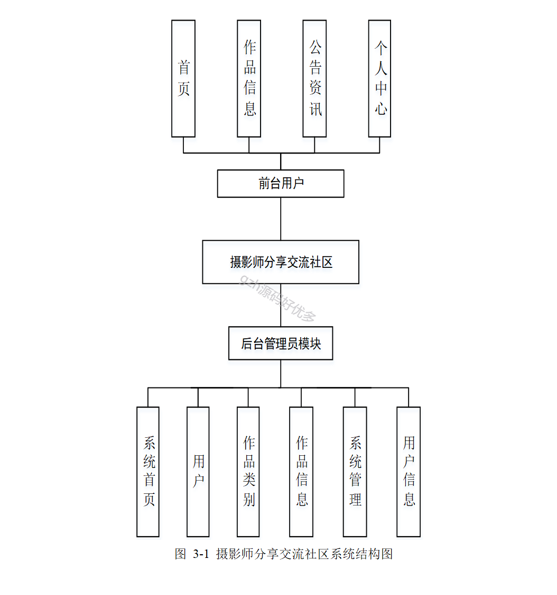
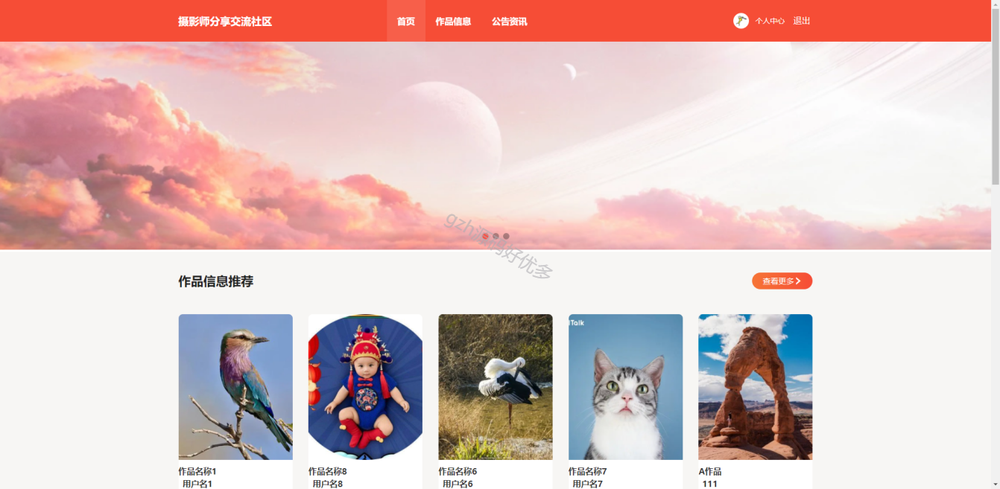
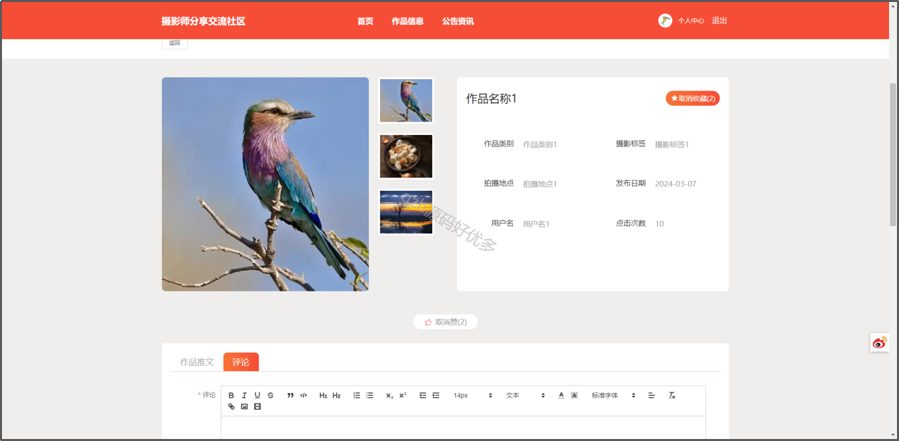
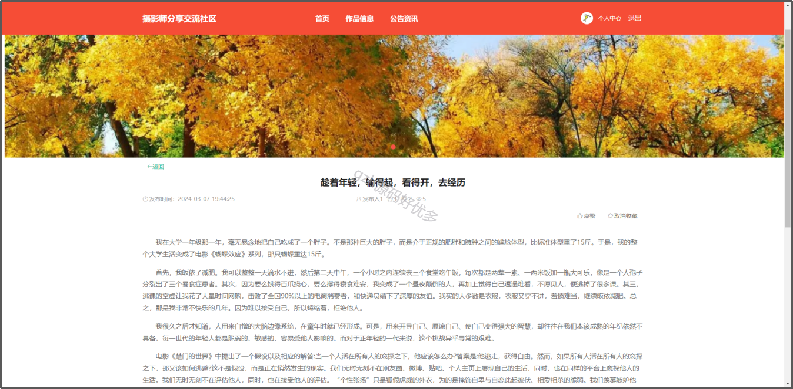
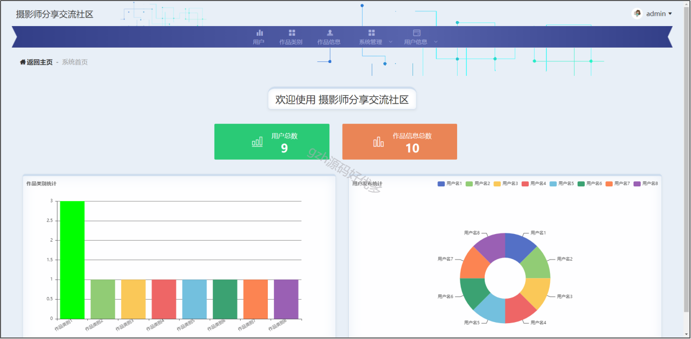
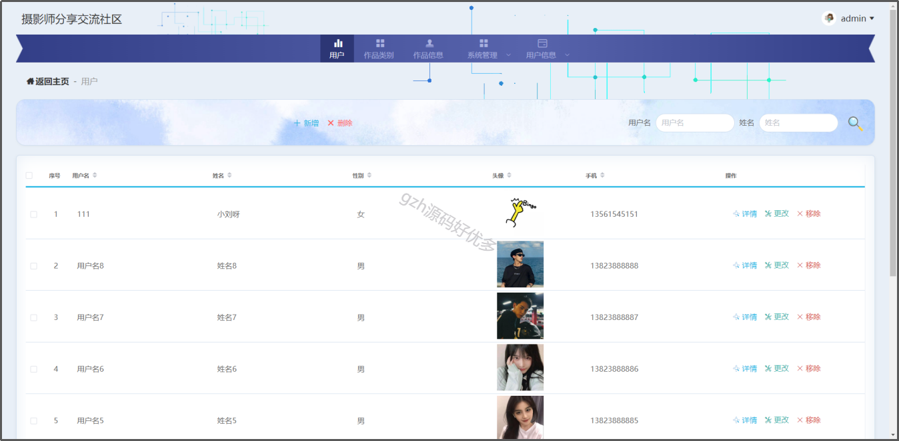
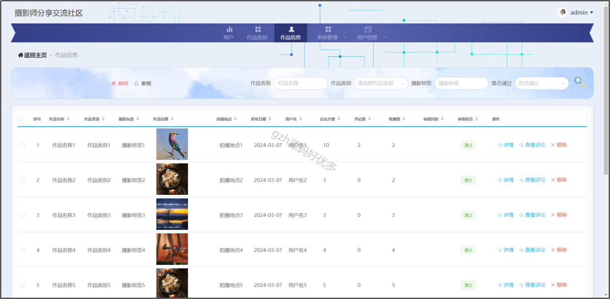
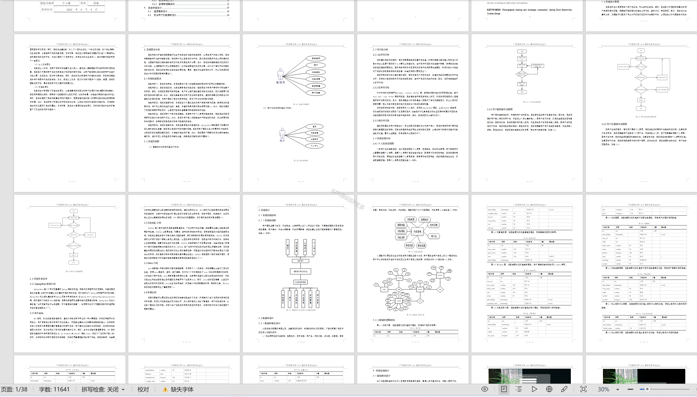

# springbootA354
springbootA354摄影师分享交流社区LW+PPT
 
## 查看主页获取源码

### 一、作品包含

源码+数据库+设计文档万字+PPT+全套环境和工具资源+部署教程

### 二、项目技术

前端技术：Html、Css、Js、Vue2、Element-ui

数据库：MySQL

后端技术：Java、Spring Boot、MyBatis

  

### 三、运行环境

开发工具：IDEA/eclipse

数据库：MySQL5.7

数据库管理工具：Navicat10以上版本

环境配置软件： JDK1.8+Maven3.6.3

前端Nodejs：14

### 四、项目介绍
项目编号：springbootA354

该系统的设计思想融合了用户友好性、专业性和创新性。首先，系统致力于提供简洁直观的用户界面和操作流程，使摄影师能够轻松快速地上传作品、参与讨论、寻找灵感。其次，系统设计注重专业性，为摄影师们提供了专业水平的技术交流和作品展示平台，以满足他们对于摄影艺术的深度探索和学习需求。同时，系统还注重创新，引入了一系列社交化、个性化的功能，如个性化推荐、社区活动等，以增强用户粘性和参与度。总体而言，系统设计思想旨在为摄影师打造一个兼具专业性和趣味性的交流平台，为他们提供一个共同学习、共同成长的社区空间

### 五、运行截图

  
